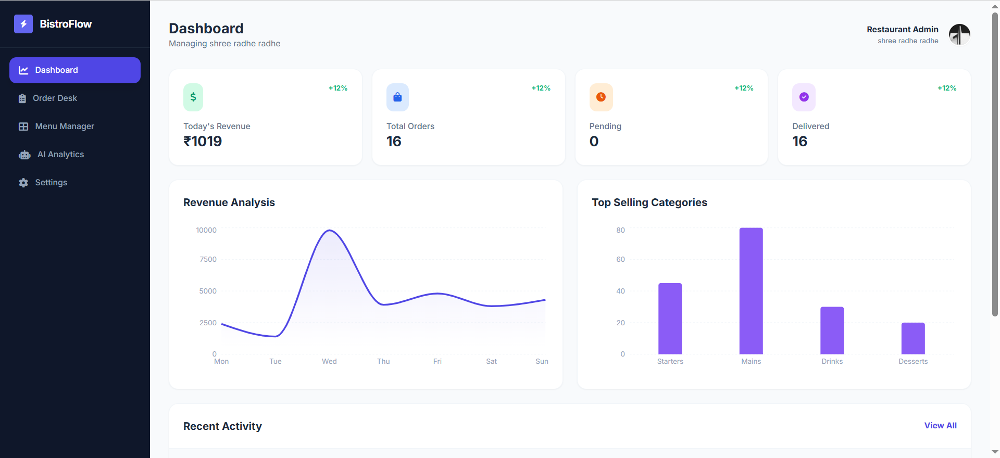
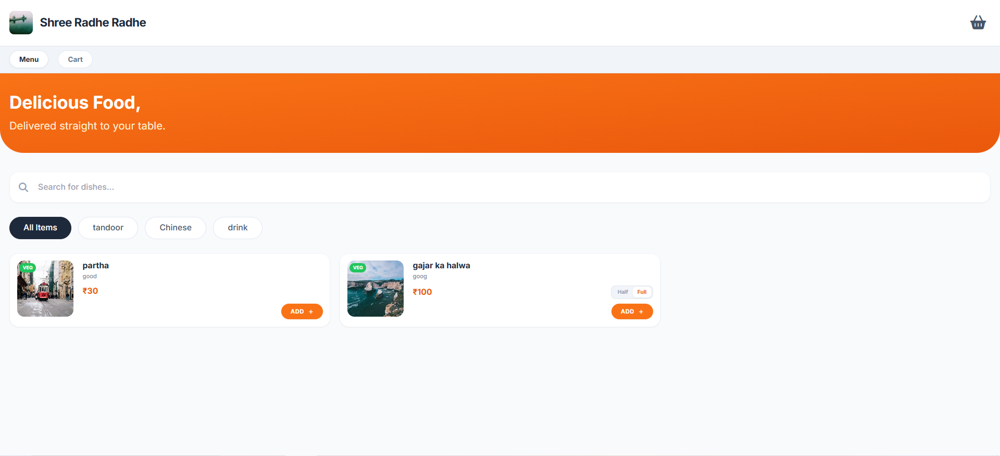

# � Laoo: The Intelligent Restaurant OS
> **Experience the future of dining. Powered by AI. Built for Speed.**

   

---

## 🚀 Why Laoo?

**Laoo** isn't just a management system; it's a **Smart Operating System** for modern restaurants. It seamlessly fuses **Kitchen Operations**, **Customer Experience**, and **Artificial Intelligence** into one fluid interface.

Stop managing orders. Start orchestrating experiences.

---

## 📸 Visual Tour

### 𝟏. The Command Center (Admin)
*A mission-control dashboard giving you god-mode visibility over your restaurant.*


### 𝟐. The Digital Experience (Customer)
*Zero-friction ordering. No apps to install. Just scan, select, and savour.*


---

## ⚡ Core Intelligence

### 🧠 AI-Powered Analyst
Meet your new business partner. **Laoo's Neural Engine** (powered by Google Gemini) analyzes your sales data in real-time to tell you:
*   *"Which dishes are underperforming?"*
*   *"What's the predicted rush hour for tonight?"*
*   *"How to optimize menu pricing?"*

### 💎 Smart Order Processing
*   **Dynamic Flow:** Adapts instantly between **Fine Dining** (Table Service) and **QSR** (Fast Food) workflows.
*   **Simple Mode:** A clutter-free, one-tap interface for busy takeout counters.
*   **Session Memory:** Customers can close their browser and return exactly where they left off.

### � Granular Financial Control
*   **Tax Engine:** Toggle GST on/off globally or per item.
*   **Dynamic Delivery:** Auto-calculate fees based on cart value. Set "Free Delivery" thresholds to boost average order value.

---

## 🛠️ The Tech Stack (Next-Gen)

Building high-performance software requires high-performance tools.

| Layer | Technology | Why? |
| :--- | :--- | :--- |
| **Frontend** | **React 19 + Vite** | Blazing fast rendering & interactions. |
| **Design** | **Tailwind CSS + Glassmorphism** | Stunning, modern, and responsive UI. |
| **State** | **Zustand (Persisted)** | Bulletproof state management. |
| **Backend** | **Node.js + Express** | Scalable, event-driven architecture. |
| **Database** | **Supabase (PostgreSQL)** | Enterprise-grade reliability. |
| **Intelligence** | **Google GenAI SDK** | Cutting-edge LLM integration. |

---

## 🏁 Quick Start Guide

Transform your restaurant in 30 seconds.

### 1. Initialize
```bash
git clone https://github.com/badarpurboom/Laoo.git
cd Laoo
npm install
```

### 2. Ignite
```bash
npm run dev
```

### 3. Deploy
Your restaurant is now live at `http://localhost:5173`.

---

## 🤝 Join the Revolution
We are building the smartest restaurant platform on the planet.
Got an idea? Found a bug? 
**[Contribute to Laoo](https://github.com/badarpurboom/Laoo/pulls)**

---

---

## ☁️ Deployment

### Hostinger VPS
Detailed step-by-step instructions for deploying to a Hostinger VPS are available here:
👉 **[Read the Hostinger Deployment Guide](HOSTINGER_DEPLOY.md)**

